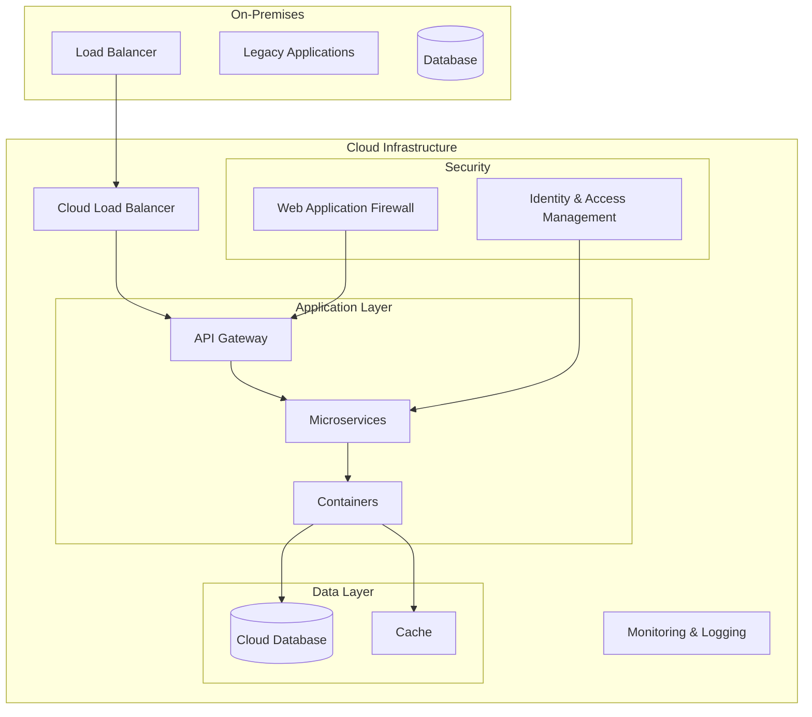

# Cloud Migration System Design

## Architecture Diagram

## Components Description

1. **On-Premises Infrastructure**
   - Legacy applications and databases that need to be migrated
   - Existing load balancer for traffic distribution

2. **Cloud Infrastructure**
   - Cloud Load Balancer for traffic distribution
   - API Gateway for request routing and management
   - Containerized microservices architecture
   - Cloud-native database solutions
   - Caching layer for performance optimization
   - Security components (IAM, WAF)
   - Monitoring and logging system

## Migration Strategy

The migration will follow a phased approach:
1. Infrastructure setup in cloud
2. Data migration
3. Application containerization
4. Gradual traffic shift
5. Legacy system decommissioning

## Security Considerations

- All data encrypted in transit and at rest
- IAM policies for access control
- Web Application Firewall for threat protection
- Regular security audits and compliance checks
