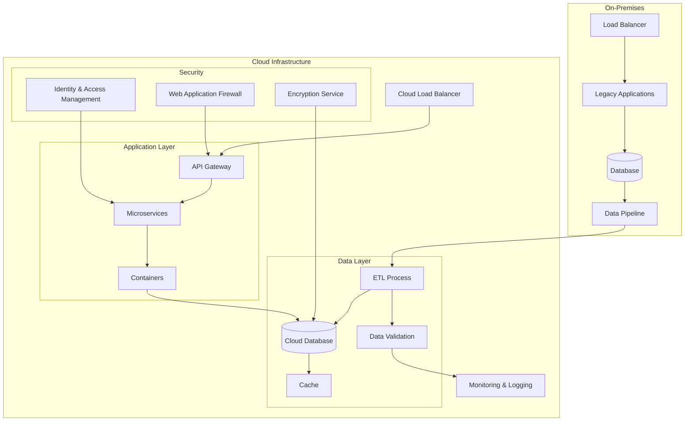

# Cloud Migration System Design

## Architecture Diagram



## Components Description

1. **On-Premises Infrastructure**
   - Legacy applications and databases that need to be migrated
   - Existing load balancer for traffic distribution

2. **Cloud Infrastructure**
   - Cloud Load Balancer for traffic distribution
   - API Gateway for request routing and management
   - Containerized microservices architecture
   - Cloud-native database solutions
   - Caching layer for performance optimization
   - Security components (IAM, WAF)
   - Monitoring and logging system

## Data Migration Architecture

### Data Transfer Pipeline
1. **Source Connection**
   - Database connectors for various source systems
   - Configurable batch sizes and throttling
   - Connection pool management

2. **ETL Process**
   - Incremental data extraction
   - Schema mapping and transformation
   - Data type conversion and normalization
   - Parallel processing capabilities

3. **Validation Layer**
   - Checksum verification
   - Record count validation
   - Data integrity checks
   - Error logging and reporting

4. **Performance Considerations**
   - Batch processing optimization
   - Network bandwidth management
   - Resource utilization monitoring
   - Retry mechanism with exponential backoff

## Migration Strategy

The migration will follow a phased approach:
1. Infrastructure setup in cloud
2. Data migration
3. Application containerization
4. Gradual traffic shift
5. Legacy system decommissioning

## Security Considerations

- All data encrypted in transit and at rest
- IAM policies for access control
- Web Application Firewall for threat protection
- Regular security audits and compliance checks

## Data Transfer Logic

The data transfer process is managed by the `cloud_transfer.py` script, which implements the following business logic:

### Transfer Workflow

1. **Pre-transfer Validation**
   - Source system availability check
   - Destination system capacity verification
   - Network bandwidth assessment
   - Required permissions validation

2. **Data Extraction Process**
   ```python
   def extract_data():
       - Implement connection pooling
       - Use configurable batch sizes (default: 1000 records)
       - Apply source-specific filters
       - Track extraction progress
       - Generate extraction metrics
   ```

3. **Transformation Rules**
   - Schema mapping based on configuration
   - Data type conversions
   - Field normalization
   - Business logic application
   - Data enrichment

4. **Loading Strategy**
   ```python
   def load_data():
       - Bulk insert optimization
       - Transaction management
       - Conflict resolution
       - Progress tracking
       - Performance metrics collection
   ```

### Business Rules Implementation

1. **Data Prioritization**
   - Critical business data first
   - Historical data in phases
   - Dependencies management
   - Resource allocation based on priority

2. **Validation Checkpoints**
   - Source-target record count match
   - Data integrity verification
   - Business rule compliance
   - Referential integrity checks
   - Custom validation rules

3. **Error Management**
   ```python
   def handle_errors():
       - Retry logic with exponential backoff
       - Error categorization
       - Notification system
       - Recovery procedures
       - Audit logging
   ```

### Performance Optimization

1. **Resource Management**
   - Dynamic scaling of resources
   - Load balancing
   - Memory optimization
   - Connection pooling
   - Batch size tuning

2. **Monitoring and Metrics**
   - Transfer speed tracking
   - Resource utilization
   - Error rates
   - Processing time
   - Success/failure ratios

### Rollback Procedures

1. **Checkpoint System**
   - Regular state snapshots
   - Transaction logging
   - Recovery points creation
   - Version control

2. **Recovery Process**
   ```python
   def rollback_transfer():
       - Identify failure point
       - Restore to last checkpoint
       - Validate restored state
       - Resume transfer
   ```

## Business Continuity

1. **Zero Downtime Strategy**
   - Parallel processing
   - Shadow writing
   - Progressive cutover
   - Fallback mechanisms

2. **Data Consistency**
   - ACID compliance
   - Eventually consistent model
   - Conflict resolution
   - Data reconciliation
